# Code Explanation

## Question 1

We basically ran a simulation multiple times, and found average values or displacement or displacement squared and found the probability of them ending at origin or of them meeting by dividing the number they ended at origin or met by the total number of trials.

We graph the findings below, comparing with the values we get mathematically. To see how we calculated the values, look at the pdf.

### probability that they meet after n steps

In the below simulation, we ran 100 trials for each value of `n`, and used the results of these trials to find the probability that they will end at the same spot after n steps.

Blue represents the estimated value, while orange is the actual mathematical probability

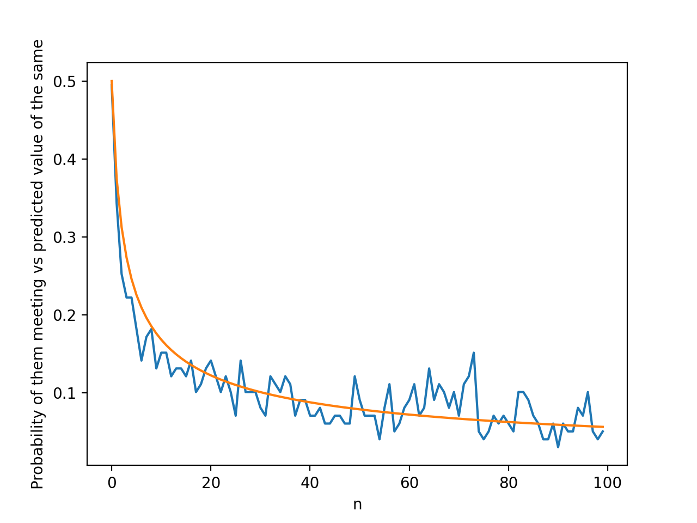

Here, we ran 10000 trials.

Blue represents the estimated value, while orange is the actual mathematical probability

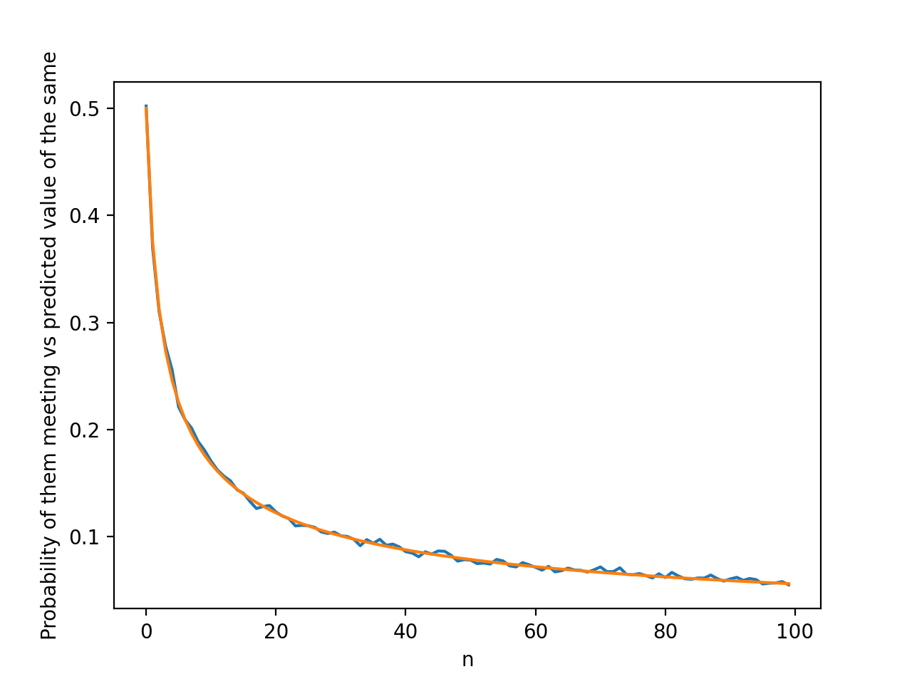

Here, we ran 100000 trials.

Blue represents the estimated value, while orange is the actual mathematical probability

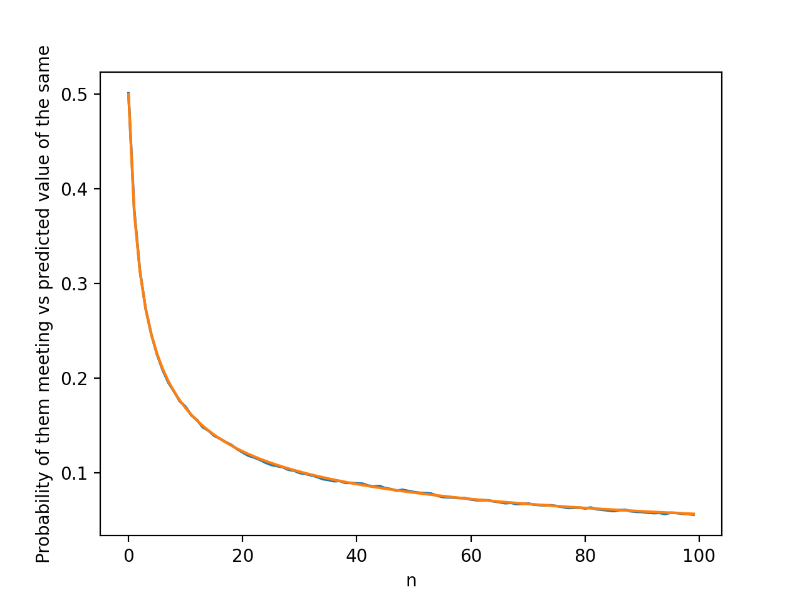

as you can see, when we run more trials, our estimate gets closer to the actual value

### probability that they end at the origin

In the below simulation, we ran 200 trials for each value of `n`, and used the results of these trials to find the probability that they will end at the origin.

Blue represents the estimated value, while orange is the actual mathematical probability

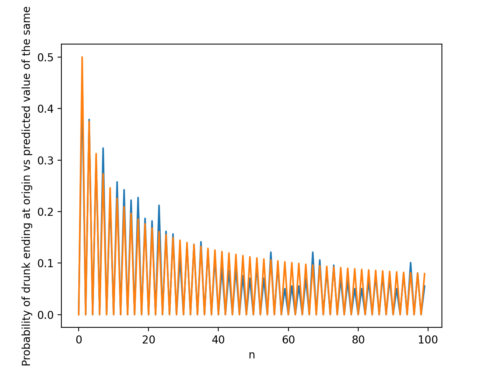

Here, we ran 20000 trials.

Blue represents the estimated value, while orange is the actual mathematical probability

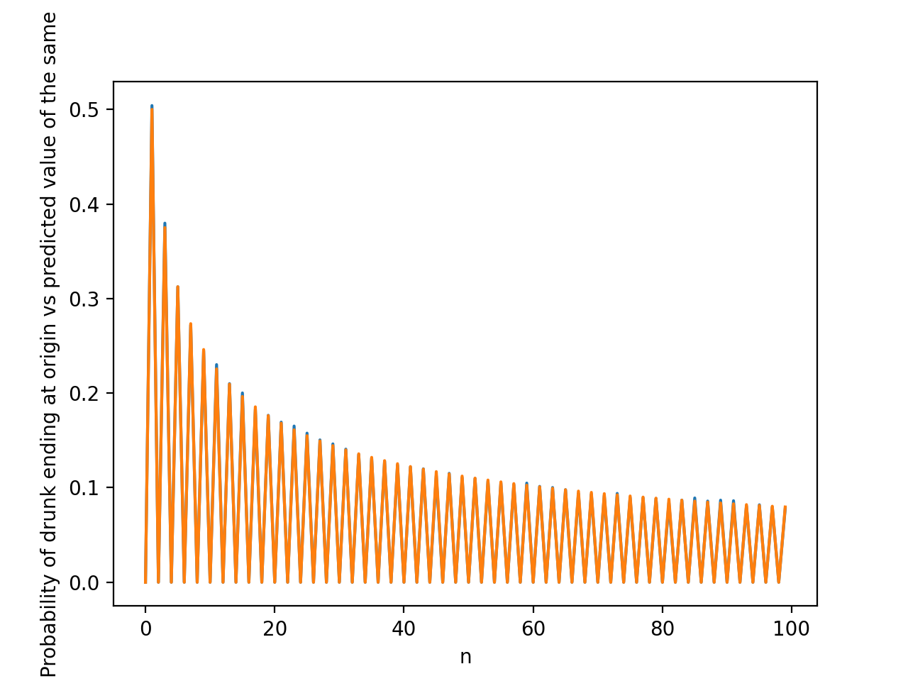

Here, we ran 200000 trials.

Blue represents the estimated value, while orange is the actual mathematical probability

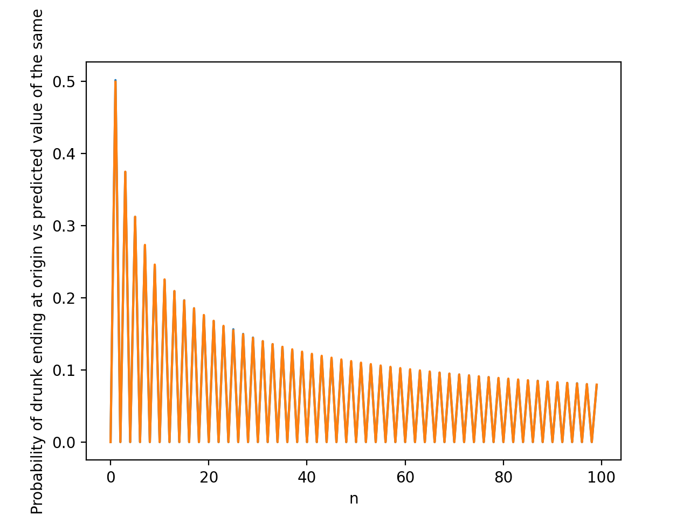

As you can see, when we run more trials, our estimate gets closer to the actual value

### Mean Displacement

In the below simulation, we ran 100 trials for each value of `n`, and used the results of these trials to find the mean displacement

Blue represents the estimated value, while orange is the actual mathematical probability

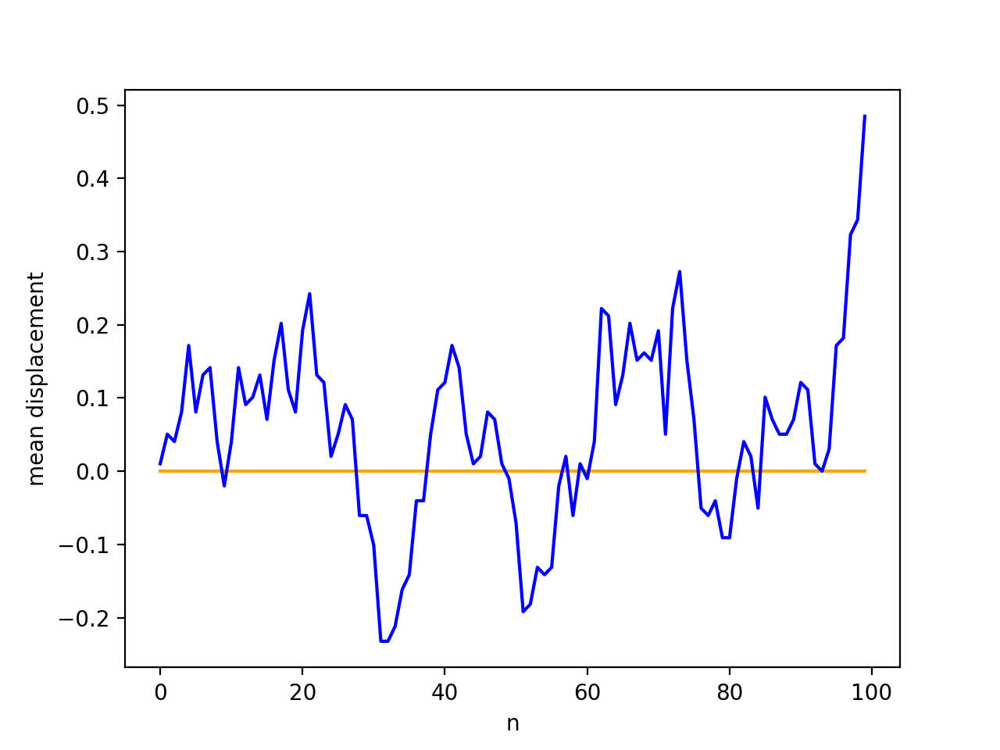

Here, we ran 10000 trials.

Blue represents the estimated value, while orange is the actual mathematical probability

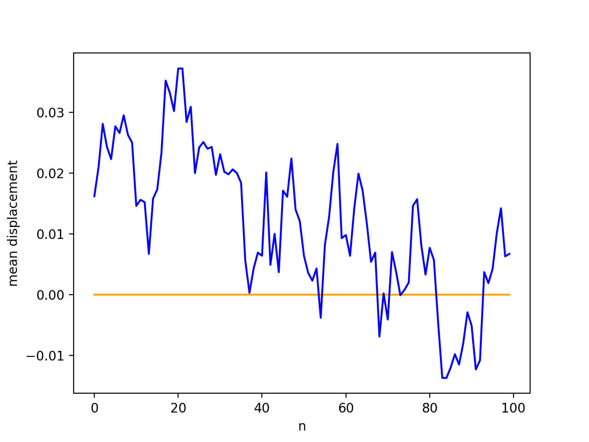

Here, we ran 100000 trials.

Blue represents the estimated value, while orange is the actual mathematical probability

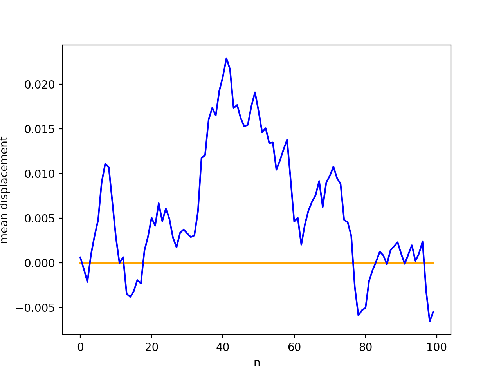

This gives random values, because of the nature of the problem. More trials wont necessarily give a more accurate value.

### Mean Squared Displacement

In the below simulation, we ran 100 trials for each value of `n`, and used the results of these trials to find the average squared displacement

Blue represents the estimated value, while orange is the actual mathematical probability

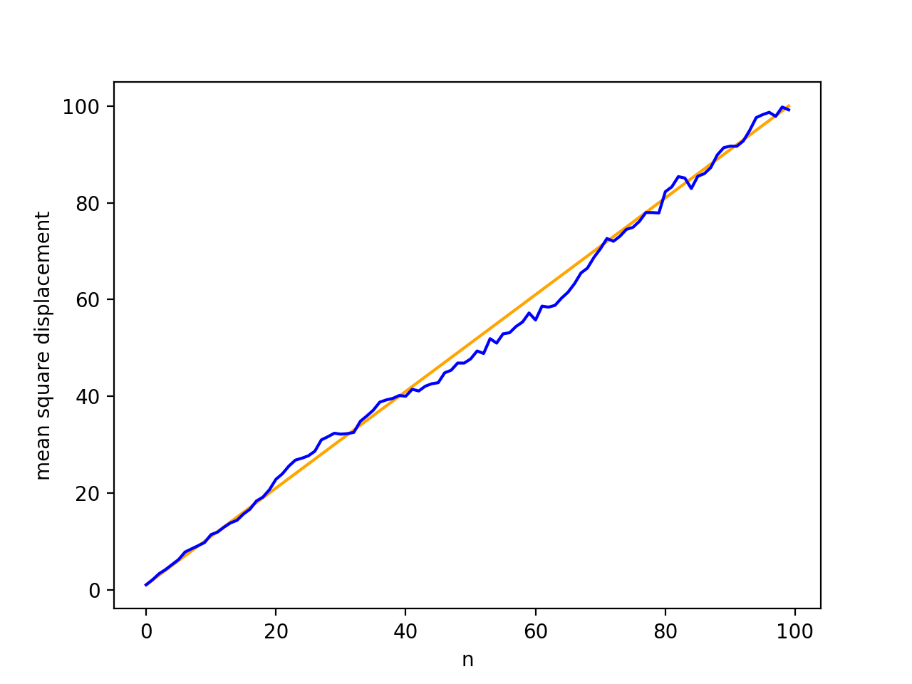

Here, we ran 10000 trials.

Blue represents the estimated value, while orange is the actual mathematical probability

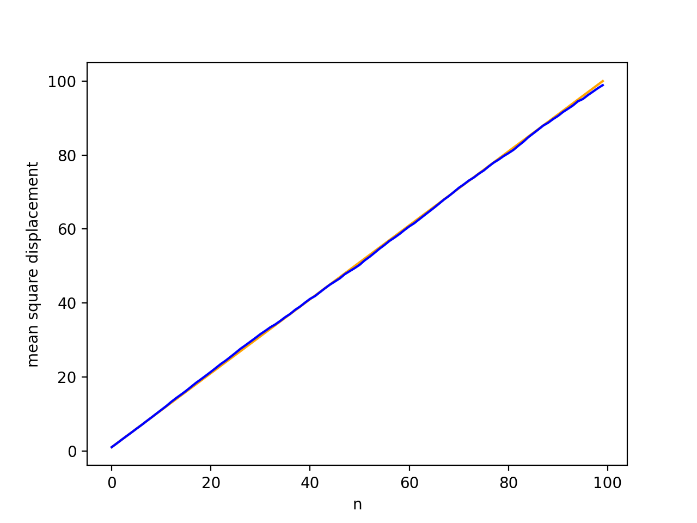

Here, we ran 100000 trials.

Blue represents the estimated value, while orange is the actual mathematical probability

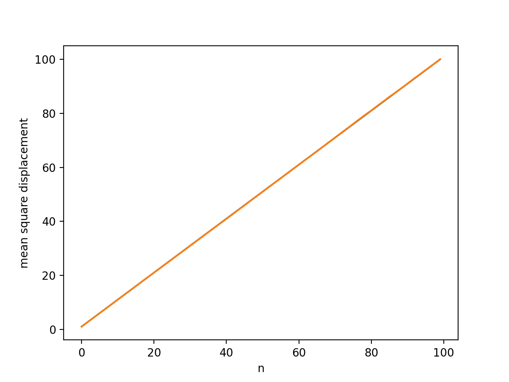

As you can see, when we run more trials, our estimate gets closer to the actual value

