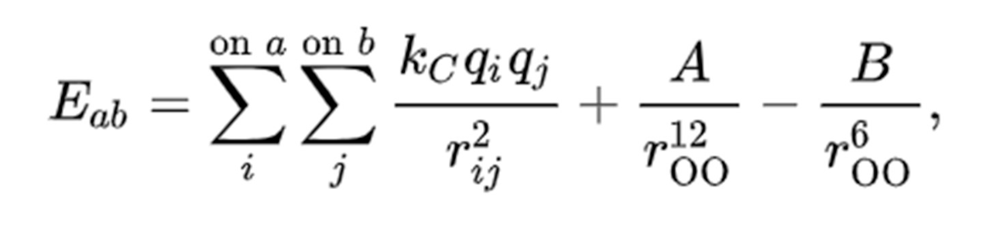

# Potential of simple water system

We find the potential energy of a system of water molecules. We hardcoded the charges into the code instead of getting them from files, as they were always the same. First we parse the pdb files to get the coordinates of the atoms of each molecule, and then we use this to calculate the potential energy.

For any two molecules, the potential energy is calculated as 



The distance here follows periodic boundary conditions with the boundaries mentioned in the report.

To run the code, first generate the .csv file as follows - 

`python3 convert1.py <path to PDB file>`

Now the the file to compute the energy - 

`python3 main.py`

The constants used are as follows - A = 582*(10**3)

**B=595**

**k = 332.1**

**Boundary conditions are -**

**lx = 23.623**

**ly = 22.406**

**lz = 27.1759**
Charges are-

**Oxygen = -0.834000**

**Hydrogen = 0.417000**

```
The potential obtained for starting_config_300k.pdb file as linked in the files directory is -5071.964855602222
```