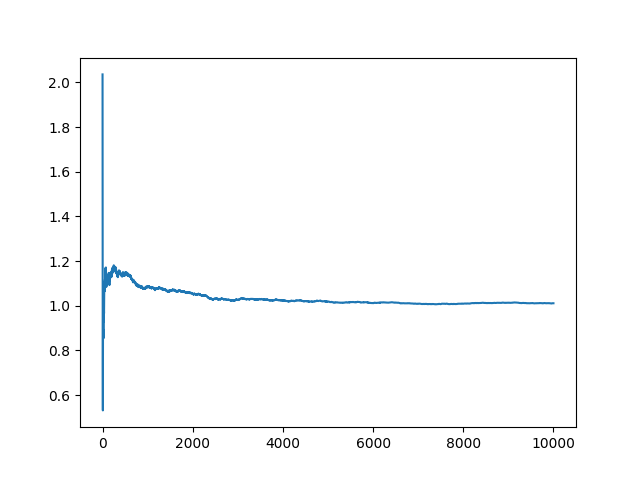
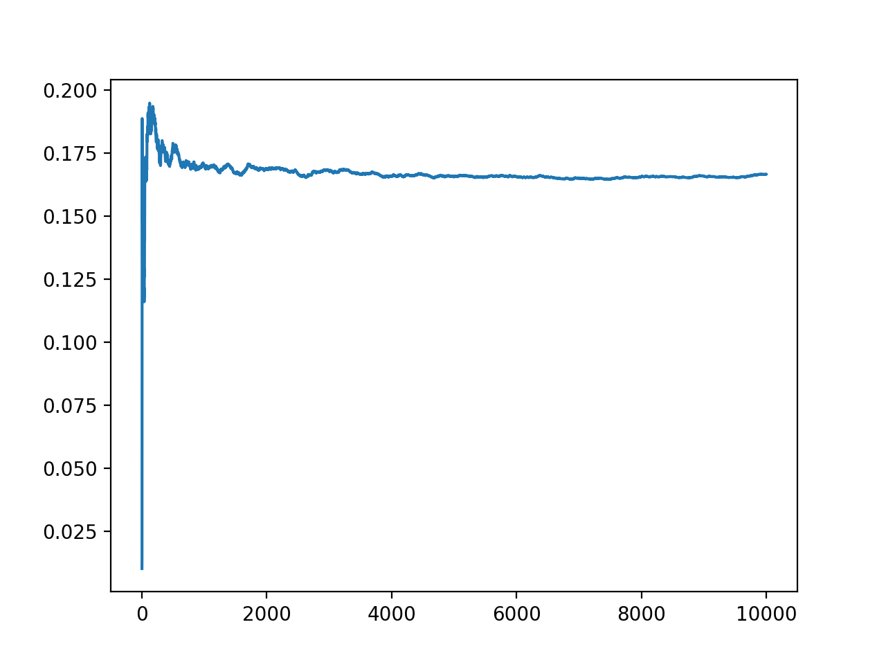
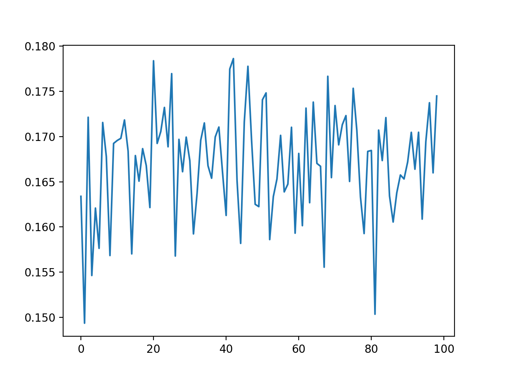
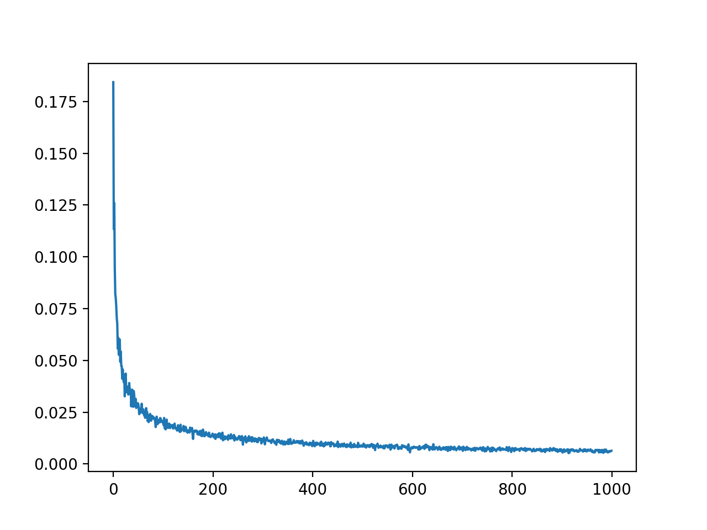

# Monte carlo integration

## Integral one

**Plot I vs Number of pointes (N)**

As we increase the number of points, the calculated vaue of the integral approaches the real value

The real value of the integral is **1**

**Fix N=20; 100 trials; Plot I vs trials; calculate std deviation.**

The standard deviation came out to be **0.19**

The plot is

**Fix N=1000; 100 trials; Plot I vs trials; calculate std deviation.**

The standard deviation came out to be **0.028**

The plot is

**Plot standard deviation (Of I vs trials) vs N for a fixed number of trials;Check if STD is proportional to sqrt(N)**

The plot is for trials = 100 and N = 1000

## Integral two

**Plot I vs Number of pointes (N)**

As we increase the number of points, the calculated vaue of the integral approaches the real value

The real value of the integral is **0.166**

**Fix N=20; 100 trials; Plot I vs trials; calculate std deviation.**

The standard deviation came out to be **0.04**

The plot is

**Fix N=1000; 100 trials; Plot I vs trials; calculate std deviation.**

The standard deviation came out to be **0.0059**

The plot is

**Plot standard deviation (Of I vs trials) vs N for a fixed number of trials;Check if STD is proportional to sqrt(N)**

The plot is for trials = 100 and N = 1000

