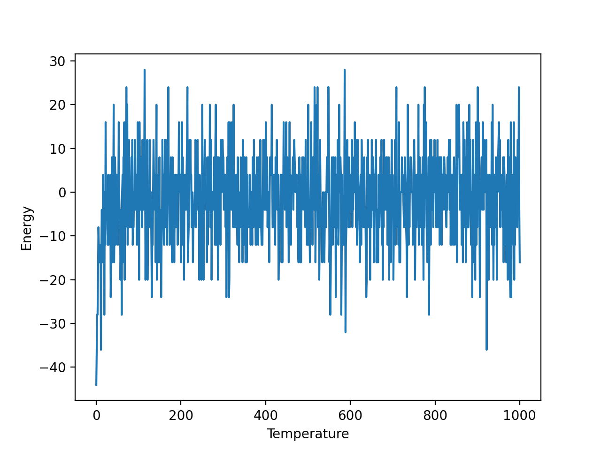
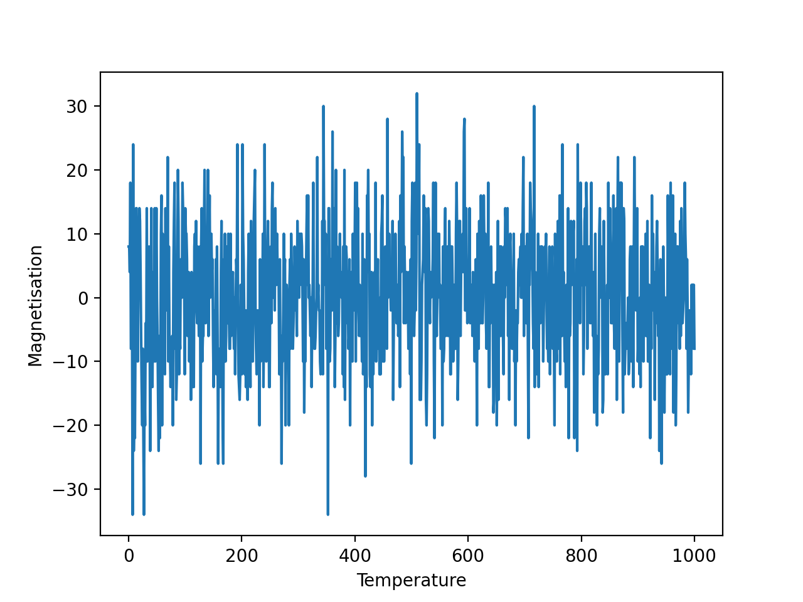
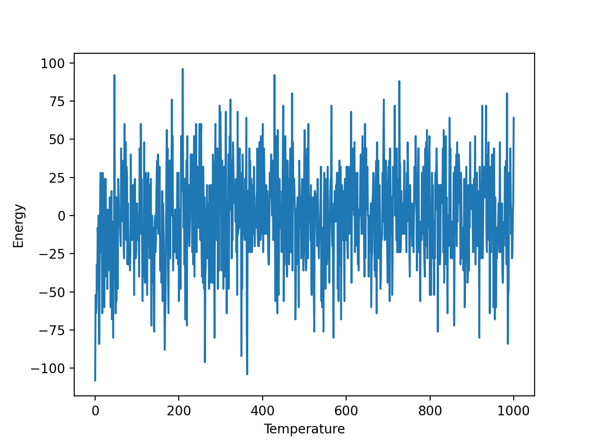

# 1D Ising Model

We chose **J=1** and **k=1**. We ran the simulation in a certain range of temperature and different model size.

## Model Size = 100 and Temperature from 0 to 100

### Energy

## Magnetization

## Model Size = 100 and Temperature from 0 to 1000

### Energy

## Magnetization

## Model Size = 1000 and Temperature from 0 to 1000

### Energy

## Magnetization
