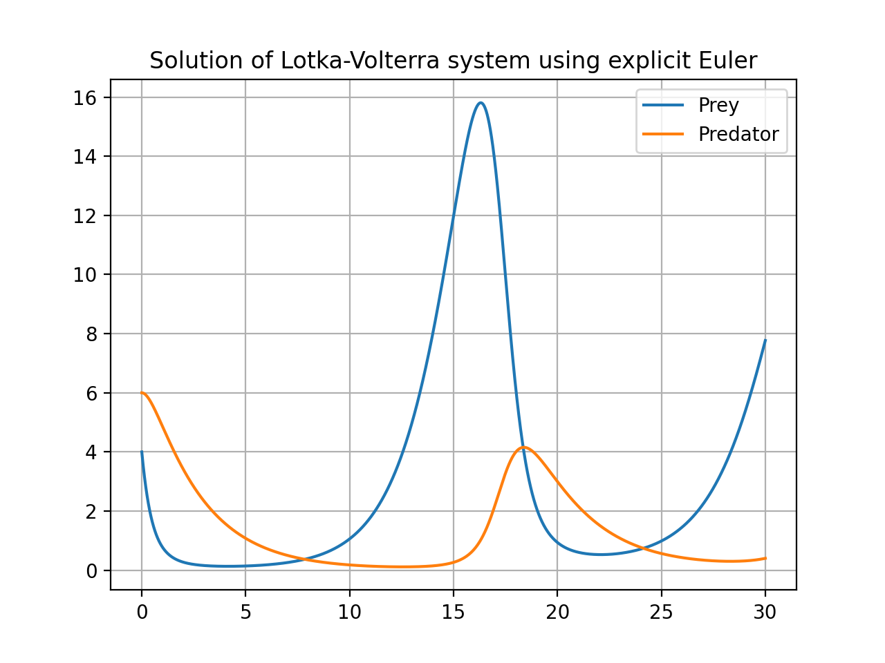
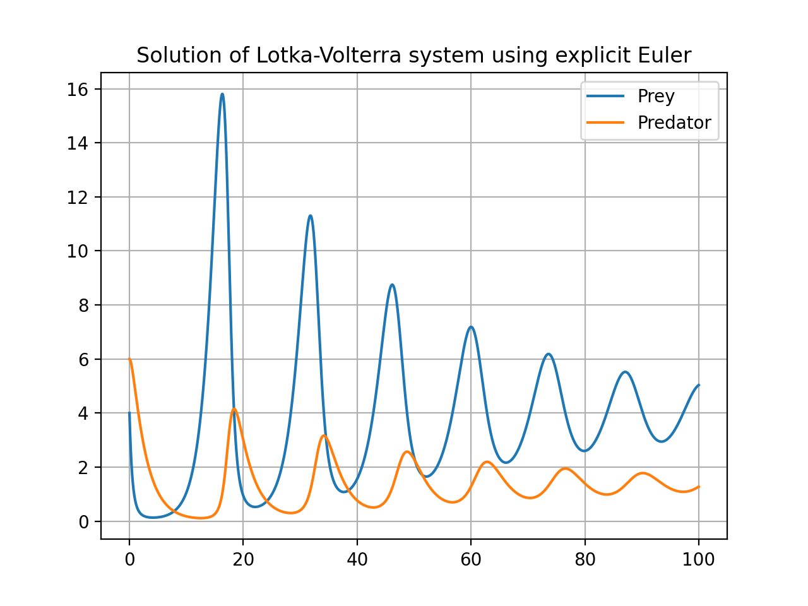
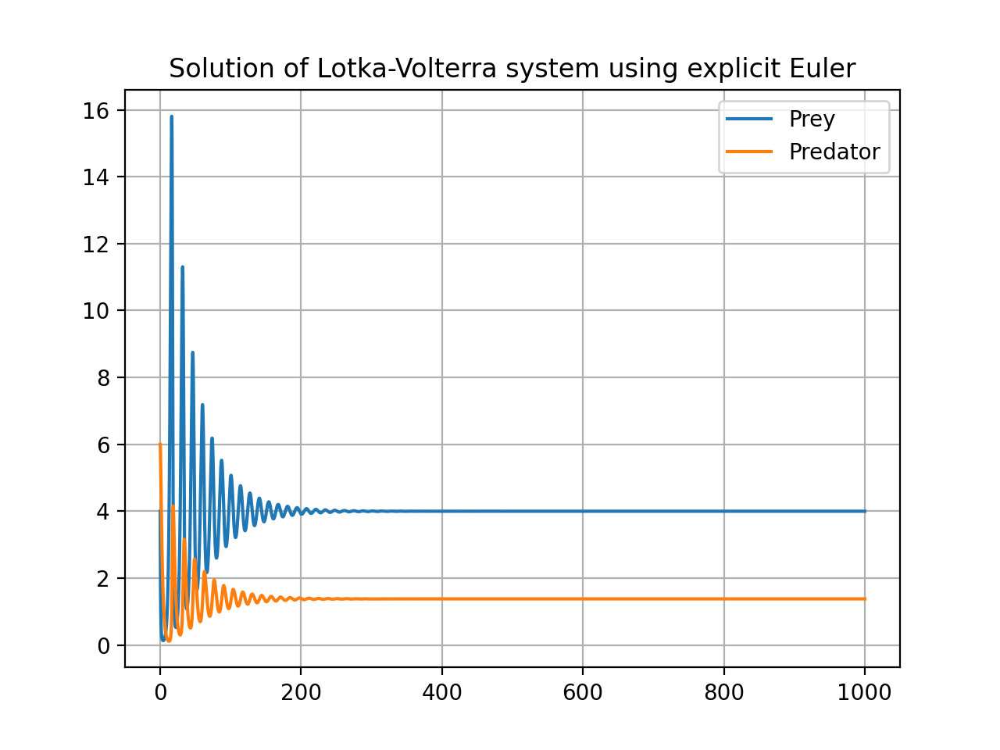
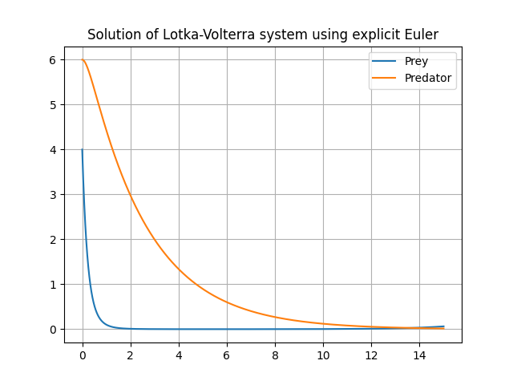
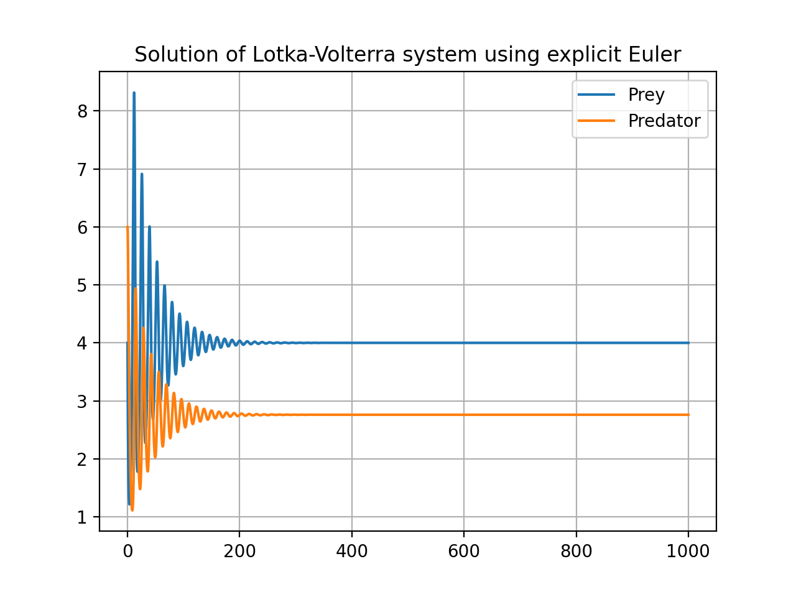

# Predator pery model

Here we solve the predator prey model and draw graphs using Euler time stepping method. The values we take are

```
gamma = 0.6
c = 0.4
alpha = 0.2
beta = 0.1
K = 50
R0, F0 = 4, 6
```

The plots are

`for duration t=30`


`for duration t=100`


`for duration t=1000`



## For differnet alphas

For an alpha of valuue 0.8, the prey dies very quickly



For an alpha of valuue 0.2, the predators's final population increases

