# science-assignments
A collection of the coding stuff we did in a science course. The questions and the project are given in `questions.pdf`. The following is an explanation of the code in each question.


## Q1
# To Run

```
pip install -r requirements.txt
python drunk.py
```

### External Libraries:

- matplotlib


# Code Explanation

## Question 1

We basically ran a simulation multiple times, and found average values or displacement or displacement squared and found the probability of them ending at origin or of them meeting by dividing the number they ended at origin or met by the total number of trials.

We graph the findings below, comparing with the values we get mathematically. To see how we calculated the values, look at the pdf.


### probability that they meet after n steps

In the below simulation, we ran 100 trials for each value of `n`, and used the results of these trials to find the probability that they will end at the same spot after n steps.

Blue represents the estimated value, while orange is the actual mathematical probability


Here, we ran 10000 trials.

Blue represents the estimated value, while orange is the actual mathematical probability

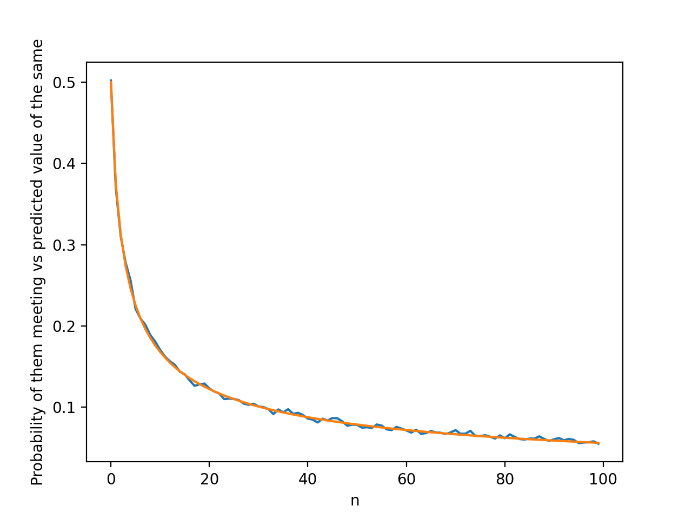

Here, we ran 100000 trials.

Blue represents the estimated value, while orange is the actual mathematical probability

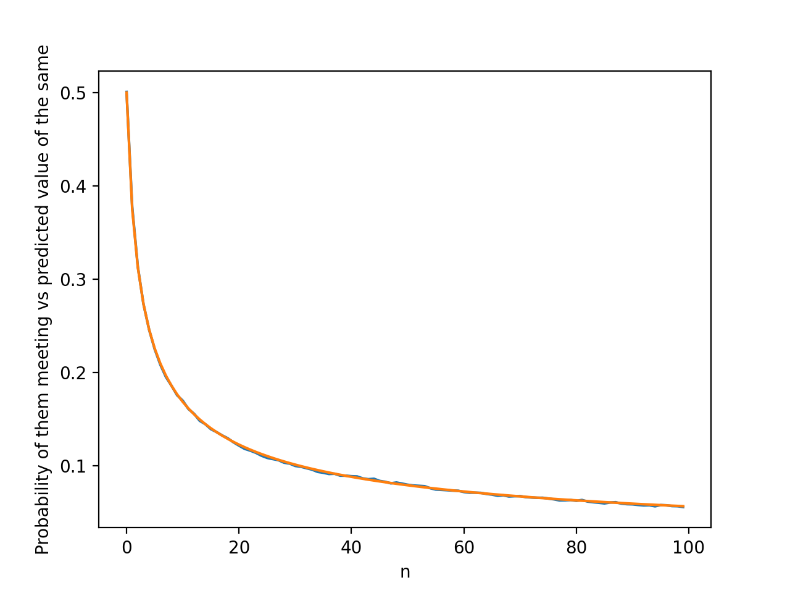

as you can see, when we run more trials, our estimate gets closer to the actual value

### probability that they end at the origin

In the below simulation, we ran 200 trials for each value of `n`, and used the results of these trials to find the probability that they will end at the origin.

Blue represents the estimated value, while orange is the actual mathematical probability

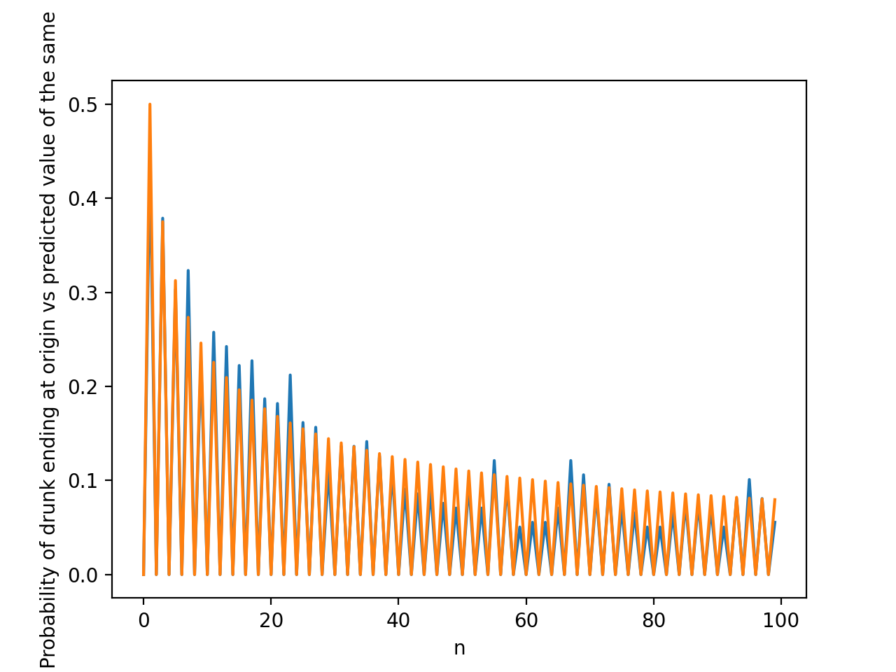

Here, we ran 20000 trials.

Blue represents the estimated value, while orange is the actual mathematical probability

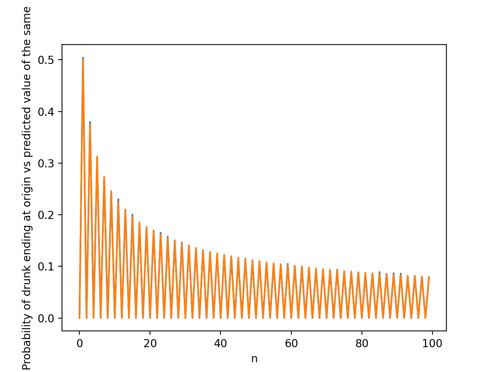

Here, we ran 200000 trials.

Blue represents the estimated value, while orange is the actual mathematical probability


As you can see, when we run more trials, our estimate gets closer to the actual value

### Mean Displacement

In the below simulation, we ran 100 trials for each value of `n`, and used the results of these trials to find the mean displacement

Blue represents the estimated value, while orange is the actual mathematical probability

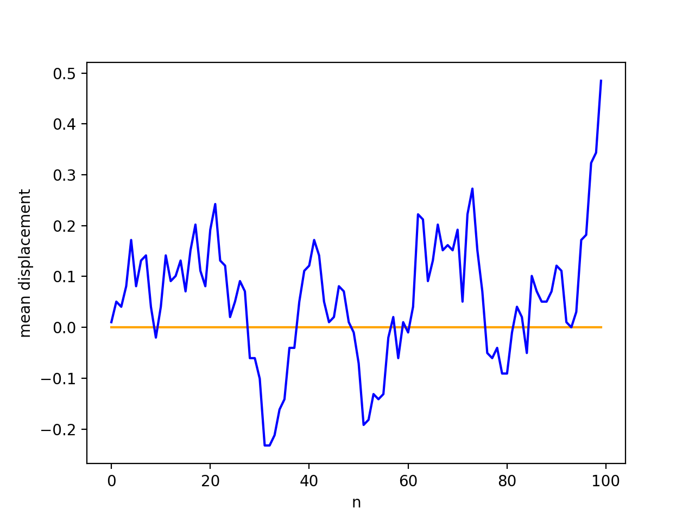

Here, we ran 10000 trials.

Blue represents the estimated value, while orange is the actual mathematical probability


Here, we ran 100000 trials.

Blue represents the estimated value, while orange is the actual mathematical probability

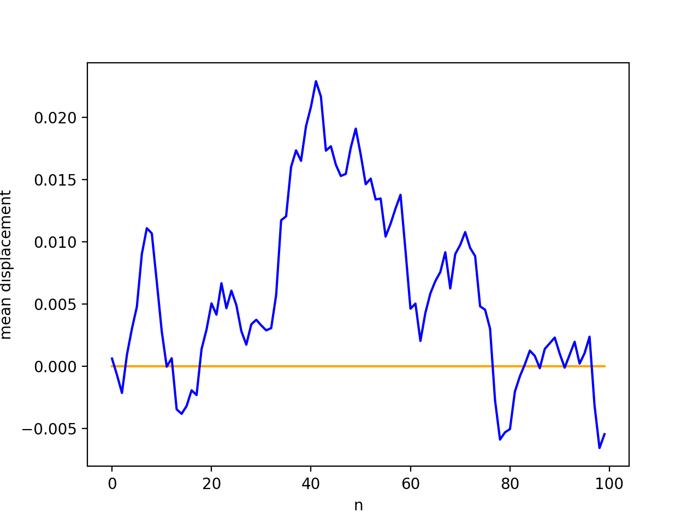

This gives random values, because of the nature of the problem. More trials wont necessarily give a more accurate value.

### Mean Squared Displacement

In the below simulation, we ran 100 trials for each value of `n`, and used the results of these trials to find the average squared displacement

Blue represents the estimated value, while orange is the actual mathematical probability

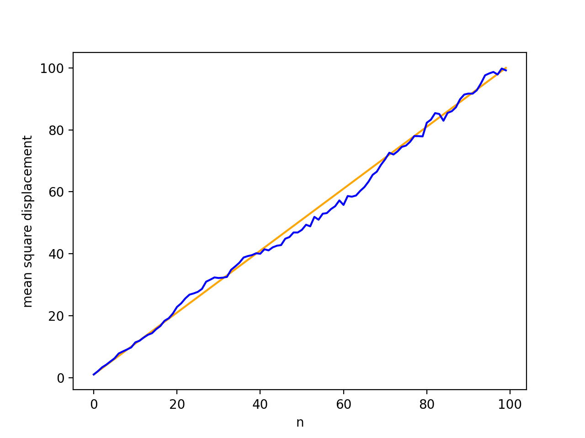

Here, we ran 10000 trials.

Blue represents the estimated value, while orange is the actual mathematical probability

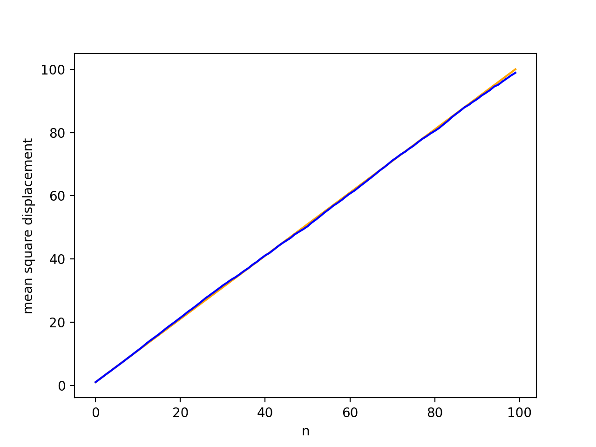

Here, we ran 100000 trials.

Blue represents the estimated value, while orange is the actual mathematical probability

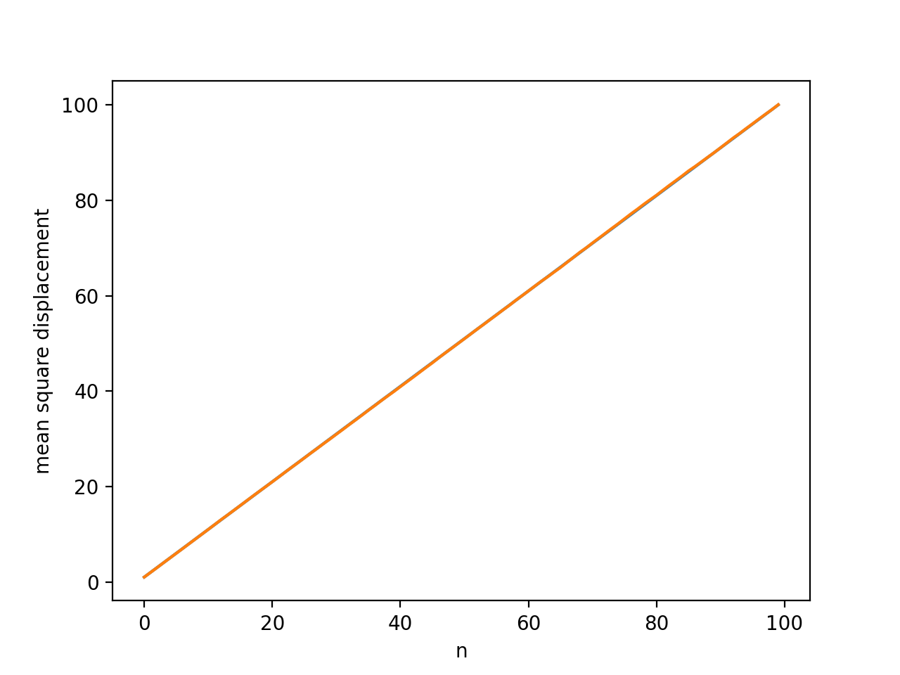

As you can see, when we run more trials, our estimate gets closer to the actual value


## Q2

Here, we calculate the value of pi using the fact that the probability of a pebble landing in the circle is 
```math
(Area of circle)/(Area of square)
= pi/4
```
So, we run a simulation, where we generate landing coordinates for pebbles and use these to determine whether they are in the circle or not. We count the number of pebbles that land in the circle, and divide by the total number of pebbles, and use this value to calculate pi.

Orange is actual value of pi, while blue is estimate


As you can see, as we take more pebbles, and use their landing to estimate pi, our estimate gets closer to pi.


## Q3

# time evolution P and X of a one Dimensional oscillator

**H = 5, K = 4, M = 1**


**H = 7, K = 10, M = 1**


**H = 9, K = 10, M = 2**


# Mean square displacement of a one Dimensional oscillator


## Q4

The plots for a 2D diffuser are as shown. Dx and Dy are measures of how quickly the material diffuses in the x and y direction respectively.

## Dx = Dy
Dx = 4, Dy =4


## Dx > Dy
Dx = 9, Dy = 4


## Dx < Dy
Dx = 4, Dy = 9


## Q5

In this we calculate the potential energy of a system of water molecules, read the report in Q5 for the rest.

## Q6
# Monte carlo integration

## Integral one


**Plot I vs Number of pointes (N)**

As we increase the number of points, the calculated vaue of the integral approaches the real value

The real value of the integral is **1**


**Fix N=20; 100 trials; Plot I vs trials; calculate std deviation.**

The standard deviation came out to be **0.19**

The plot is


**Fix N=1000; 100 trials; Plot I vs trials; calculate std deviation.**

The standard deviation came out to be **0.028**

The plot is


**Plot standard deviation (Of I vs trials) vs N for a fixed number of trials;Check if STD is proportional to sqrt(N)**

The plot is for trials = 100 and N = 1000


## Integral two
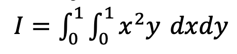

**Plot I vs Number of pointes (N)**

As we increase the number of points, the calculated vaue of the integral approaches the real value

The real value of the integral is **0.166**


**Fix N=20; 100 trials; Plot I vs trials; calculate std deviation.**

The standard deviation came out to be **0.04**

The plot is


**Fix N=1000; 100 trials; Plot I vs trials; calculate std deviation.**

The standard deviation came out to be **0.0059**

The plot is


**Plot standard deviation (Of I vs trials) vs N for a fixed number of trials;Check if STD is proportional to sqrt(N)**

The plot is for trials = 100 and N = 1000


## 7

# 1D Ising Model

We chose **J=1** and **k=1**. We ran the simulation in a certain range of temperature and different model size.

## Model Size = 100 and Temperature from 0 to 100

### Energy


## Magnetization


## Model Size = 100 and Temperature from 0 to 1000

### Energy


## Magnetization


## Model Size = 1000 and Temperature from 0 to 1000

### Energy


## Magnetization


## 8
# Predator prey model

Here we solve the predator prey model and draw graphs using Euler time stepping method. The values we take are

```
gamma = 0.6
c = 0.4
alpha = 0.2
beta = 0.1
K = 50
R0, F0 = 4, 6
```

The plots are

`for duration t=30`
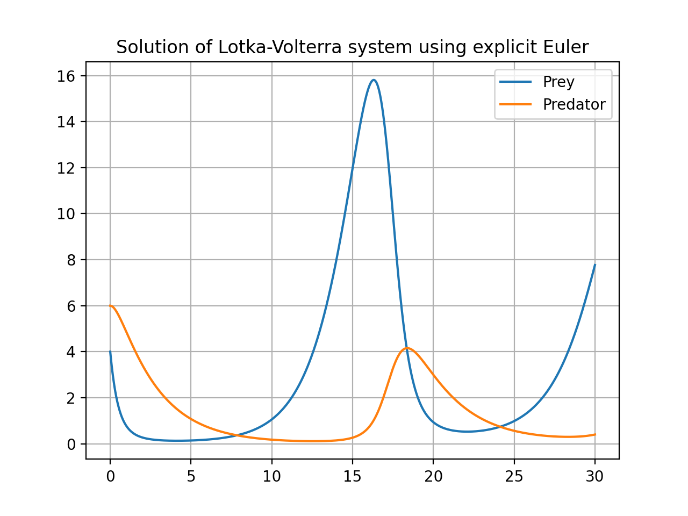

`for duration t=100`
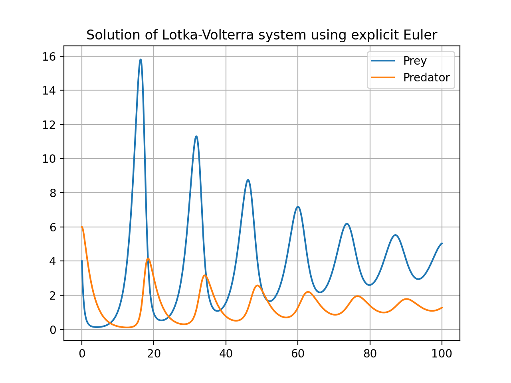

`for duration t=1000`
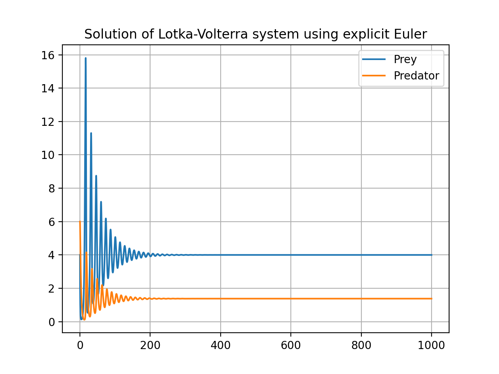


## For differnet alphas

For an alpha of valuue 0.8, the prey dies very quickly

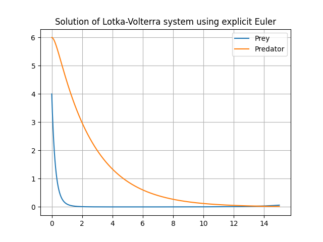

For an alpha of valuue 0.2, the predators's final population increases

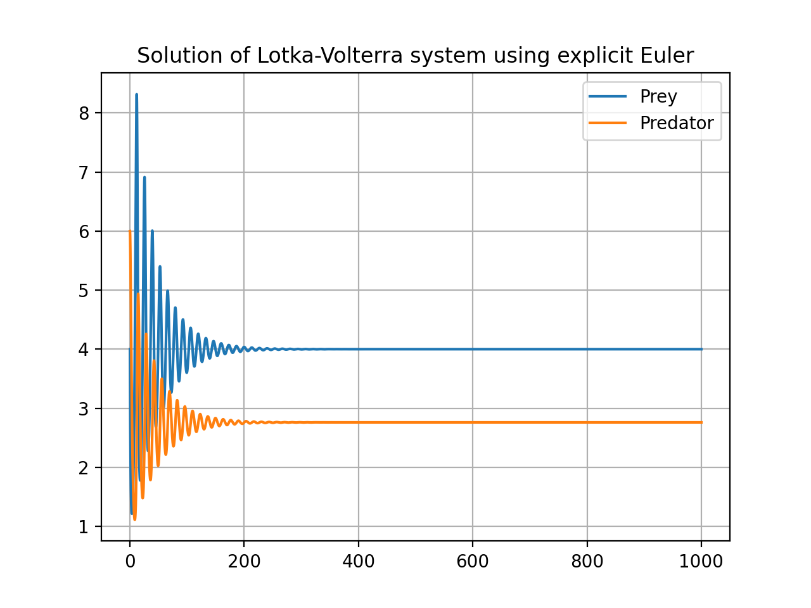

## Project

initial configuration is stored in **initial.xyz**

Optimised configuration is stored in **optimal.xyz**

The potential energy obtained with each step is printed, with the step number.

The optimized potential energy is printed to screen

Hessian matrix is stored in **hessian.txt**

the eigenvalues and vectors are stored in **eigen.txt**

SI units have been used for everything.


## Question 1
Here, we generate particles at random locations, and make sure that no two particles have a distance less than 3.4A between them. WHen we have enough particles we store them in an array.

## Question 2

We find the potential energy of the system by calculating interactions between every pair of molecules, and then using the Lennard-Jones potential to find the value of the potential.

This is the formula we use
$$
U_{LJ} (r_{ij}) = 4\epsilon[(\frac\sigma{r_{ij}})^12 - (\frac\sigma{r_{ij}})^6]
$$


## Question 3

To decrease the potential of the system, we find the force acting on each particle and then step by step move the particles in the direction of the force. This results in a new configuration, to which we apply the same step. We do this until the change in potential energy we get from an iteration is very small.

The find the force on a particle, we differentiate the formula of the potential, and we use the new formula to find the force. We have to find the force on a certain particle by every other particle in the system, and sum up all these forces to find the final net force acting on that one particle.


## Question 4
For each element in the Hessian Matrix, we calculate the double derivative of the potential as described in class.  
$$
H_{ij} = \frac{\part U_{ij}}{\part{n_l}\part{m_k}}
$$
Here, n and m correspond to either x, y, or z depending on the values of i and j. l and k correspond to which atom we are referring to.

We then use `np.linalg.eig()` to get the eigenvalues and eigenvectors of the Hessian Matrix which are outputted in a separate file.

# External Libraries:

- Numpy